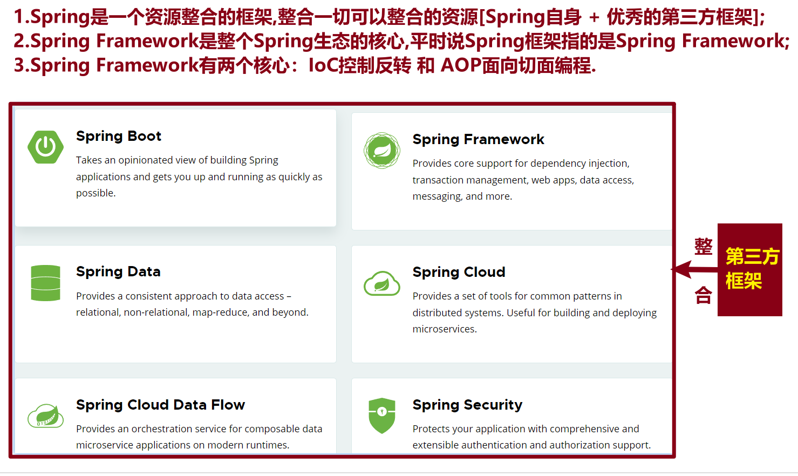
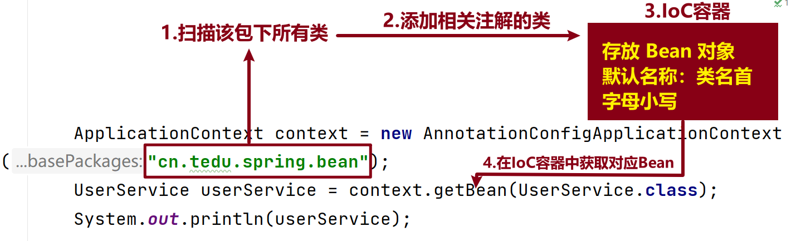

[TOC]

### 1 框架

<font color=red>**让程序员专注于业务逻辑, 进而提升开发效率.**</font>

框架的主要作用是帮助开发人员快速、高效地开发应用程序，提供一套完整的系统结构、规范的开发流程、通用的功能和模块、配置文件管理、错误和异常管理以及数据库支持等，为开发人员提供了便利的开发工具和方法。

- Java相关框架：`Spring`
- Python相关框架：`Django、Flask、Tornado`

### 2 Spring框架

官网: [https://spring.io](https://gitee.com/link?target=https%3A%2F%2Fspring.io)

#### 2.1 定义

我们平时所说的spring框架,指的就是 **Spring Framework**



####  2.2 Spring版本

- Spring6: 只支持 `JDK17` 及以上版本
- Spring5: 支持 `JDK8-15` 版本,课程中采用: <font color=red>**5.3.24**</font>

#### 2.3 使用流程-注解方式

- 第1步: 添加依赖, 刷新 `maven`;

- 第2步: 在指定类上添加注解: `@Component`

- 第3步: 创建测试类

  ```java
  //1.创建IoC容器;
  ApplicationContext context = new AnnotationConfigApplicationContext("包路径");
  //2.获取Bean;
  context.getBean(类型.class);
  ```

### 3 对象

- `Java` 对象: 开发人员手动创建的对象, 叫做 `Java` 对象.

- `Spring Bean` 对象: 由 `Spring` 框架创建的对象叫做 `Spring Bean` 对象.

  <font color=red>**这两种对象在使用上没有任何差别, 只是为了区分对象创建的方式.**</font>

### 4 相关概念

- IoC

  控制反转的编程思想, 反转资源的获取方向;

  把对象的创建和管理交由框架来完成, 而不是由开发人员手动创建和管理.

- IoC容器

  实现IoC控制反转思想的一种技术手段.

  创建IoC容器

  ```java
  ApplicationContext context = new AnnotationConfigApplicationContext("包路径");
  ApplicationContext context = new ClasspathXmlConfigApplicationContext("xxx.xml");
  ```

- 依赖注入-DI

  给 `Spring Bean` 对象的属性赋值.

  <font color=red>**IoC是控制反转思想, IoC容器和DI依赖注入是实现IoC控制反转思想的两种技术手段.**</font>

### 5 IoC容器实现

- <font color=red>**实现: ApplicationContext 接口.**</font>

- 实现方式

  - 注解方式构建IoC容器: `AnnotationConfigApplicationContext`
  - xml配置文件方式构建IoC容器: `ClasspathXmlApplicationContext`

  

### 6 常用注解

#### 6.1 标识为Spring Bean注解

- **Component**
  - 添加在类上，创建Spring Bean对象；
  - 不分层。
- **Controller**
  - 添加在类上，创建Spring Bean对象；
  - 控制器层：负责接收请求并返回响应。
- **Service**
  - 添加在类上，创建Spring Bean对象；
  - 业务层：负责具体业务逻辑处理。
- **Repository**
  - 添加在类上，创建Spring Bean对象；
  - 数据访问层：负责和数据库[**MySQL和MariaDB**]交互。

#### 6.2 DI依赖注入注解

- `@Value`

  <font color=red>**2个位置**</font>：添加在属性上, set方法上

  简单类型依赖注入.

- `@Autowired`

  <font color=red>**3个位置**</font>：添加在属性上，添加在set方法上，构造方法上；

  对象类型或者接口类型依赖注入，默认根据 **类型** 进行装配；

- `@Qualifier`

  根据 `Spring Bean`对象的名称进行注入, 经常配合 `@Autowired` 注解一起使用;

  当一个接口有多个实现类时, 可以通过 `@Qualifier(value="Bean对象名称")` 指定需要注入的对象.

* `@Resource`

  对象类型属性值注入;

  **@Autowired注解和@Resource注解的区别**

  - `@Resource` 注解是JDK的标准注解, `@Autowired` 注解是Spring框架的注解;
  - <font color=red>**装配规则**</font>
    - `@Autowired` 注解默认根据类型进行装配, 如果需要根据名称进行装配, 结合 `@Qualifier` 注解;
    - `@Resource` 注解
      - 默认根据名称进行装配[`@Resource` 注解的 `name` 参数];
      - 如果未指定 `name` 参数, 则以 属性名作为`Bean`对象名称进行装配;
      - 如果属性名和`Bean`对象名称也不一致, 则根据类型进行装配.

####  6.3 作用域注解

- `@scope`

  作用域注解

  - singleton: 单例模式[<font color=red>**默认**</font>],Bean对象只有1个, 创建IoC容器时,创建Bean对象;
  - prototype: 多例模式,Bean对象有多个, 每次在IoC容器中获取Bean对象时[getBean(类名.class)], 才会创建Bean对象

  <font color=red>**平时写项目时,使用框架的单例模式.**</font>

#### 6.4 生命周期注解

- `@PostConstruct`

  生命周期初始化方法，在对象构建以后执行；

- `@PreDestroy`

  生命周期销毁方法，比如此对象存储到了IoC容器，那这个对象在IoC容器关闭之前会先执行这个生命周期的销毁方法。

####  6.5 引入外部属性文件注解

- `@PropertySource`

  引用外部属性文件的注解,添加在类上;

  使用示例: `@PropertySource("classpath:application.properties")`

### 7 Bean对象生命周期

- 第1步: 实例化, 通过 `构造方法` 实现;
- 第2步: 属性赋值, 通过 `set方法` 实现;
- 第3步: 初始化, 通过`@PostConstruct` 注解执行初始化的方法;
- 第4步: 使用, 通过 `context.getBean(类名.class);`
- 第5步: 销毁, 通过 `@PreDestroy` 注解执行Bean对象销毁之前的方法.

### 8 引入外部属性文件

- 第1步：创建配置文件，放在`resources`目录下，并且以 `.properties .yml .yaml` 结尾；
- 第2步：通过 `@PropertySource("配置文件路径")` 引入配置文件；
- 第3步：通过 `${配置名称}` 获取具体的配置.

### 9 自动扫描

- 工程目录下创建配置文件: **config.SpringConfig**

  ```java
  /**
   * Configuration注解: 当前类为配置类,Spring会自动加载此类;
   * ComponentScan注解:
   *    1.自动扫描注解,指定包扫描的路径;
   *    2.自动扫描该包以及该包的子孙包中的所有的类,为其创建Spring Bean对象;
   */
  @Configuration
  @ComponentScan("cn.tedu.spring")
  public class SpringConfig {
  }
  ```

### 10 常用快捷键

- 复制完整路径
  - Windows
    - `Ctrl + Shift + Alt + c`
    - `Fn + Ctrl + Shift + Alt + c`
  - Mac
    - `Command + Shift + c`

### 11 常见异常

- `NoSuchBeanDefinitionException`

  ```java
  org.springframework.beans.factory.NoSuchBeanDefinitionException: No qualifying bean of type 'cn.tedu.spring.bean.UserService' available ...
  ```

  **解决方案：**

  - 查看该类上是否添加标识为 `Spring` 组件的注解；
  - 检查相关注解 `Spring Bean` 对象的名称是否一致；

- `NoUniqueBeanDefinitionException`

  ```java
  Caused by: org.springframework.beans.factory.NoUniqueBeanDefinitionException: No qualifying bean of type 'cn.tedu.spring.auto.Cache' available: expected single matching bean but found 2: AAAA,cacheImpl2
  ```

  **解决方案：**

  一个接口有多个实现类，通过 `@Qualifier` 或者 `@Resource` 注解指定唯一的 `Bean` 对象的名称.

- `FileNotFoundException`

  ```java
  Caused by: java.io.FileNotFoundException: class path resource [application.propertise] cannot be opened because it does not exist
  ```

  **解决方案：**

  检查文件名和具体路径.

### 12 单词

* `Spring Framework`
* `Component`
* `Controller`
* `Service`
* `Repository`
* `Value`
* `Autowired`
* `Qualifier`
* `Resource`
* `Scope 、 singleton 、prototype`
* `PostConstruct`
* `PreDestroy`
* `PropertySource`
* `Configuration`
* `ComponentScan`
* `ApplicationContext`
* `AnnotationConfigApplicationContext`
* `ClasspathXmlApplicationContext`


