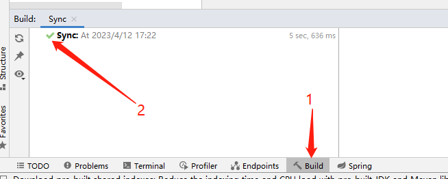
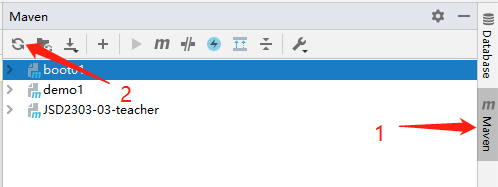
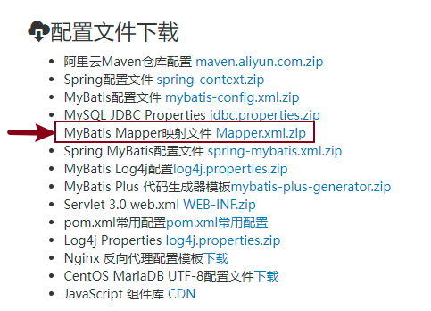

[TOC]

## SSM框架

### 1 SSM框架说明

* Spring

  指 `Spring Framework`，是Spring家族的核心。

* Spring MVC

  `SpringMVC` 是 `Spring Framework` 的核心子项目，提供了一系列功能，使得开发者能够快速开发灵活、易于维护的Web应用程序。

* MyBatis

  `MyBatis` 是基于 Java 的持久层框架，用于和数据库映射；
  
  `MyBatis` 避免了几乎所有的JDBC代码和手动设置参数以及获取结果集的工作；
  
  `MyBatis` 通过注解方式或者xml配置文件的方式来配置SQL和映射关系，灵活性非常高。

### 2 SpringBoot

#### 2.1 SpringBoot简述

`Spring Boot` 是一个Java软件开发框架（<font color=red>**脚手架**</font>）；

设计目的：简化项目的初始搭建以及开发过程，该框架机制使开发人员不再需要大量的手动依赖管理。

#### 2.3 SpringBoot核心特性

* **起步依赖**

  创建 `SpringBoot` 工程时告知需要什么功能，`SpringBoot` 就可以引入需要的依赖库；

* **自动配置**

  `Spring Boot` 能自动提供相关配置，针对很多Spring应用程序和常见的应用功能；

  比如：当 `Spring Boot` 检测到工程中存在某个注解或类时，它会自动将相关的 `bean` 注册到 `Spring` 容器中，而无需手动配置；

* **嵌入式服务(Tomcat)**

  SpringBoot工程支持内嵌的web服务，可以将tomcat这样的服务直接嵌套到web依赖中。

#### 2.4 Spring Boot项目配置工具

* `Spring` 提供：https://start.spring.io
* `SpringBoot` 提供：https://start.springboot.io
* `aliyun` 提供：https://start.aliyun.com

<font color=red>**注意：目前 Spring 和 SpringBoot 提供的配置工具不支持JAVA 8版本，阿里云的配置工具支持。**</font>

### 3 创建SpringBoot工程

#### 3.1 创建SpringBoot工程

1. 创建工程 **_04MYBATIS**

   * 创建SpringBoot工程时需要将地址改为：https://start.aliyun.com

   * 选择SpringBoot来创建工程：**Spring Initalizr**

     

2. **Spring Boot版本为2.6.13**

   **勾选依赖项：MyBatis Framework 和 MySQL Driver**

   


#### 3.2 创建工程失败排查

* 创建完工程后，查看Build页卡中是否显示了绿色的对钩



* 如果没有显示绿色对钩而是红色报错，解决方案如下

  * 检查maven配置

    

  * 刷新maven

    

  * 如果刷新之后还没有成功

    检查Maven配置是否正确，检查 .m2 目录下是否包含 settings.xml 文件


## MyBatis框架-注解管理

### 1 概述

Mybatis是一个优秀的持久层框架，底层基于JDBC实现与数据库的交互；

使用此框架程序员只需要通过注解或者修改xml配置文件的方式配置好需要执行的SQL语句，MyBatis框架会根据SQL语句生成对应的JDBC代码并对数据库中数据进行增删改查操作。

Mybatis框架的简单应用架构，如图所示：


​		

### 2 数据初始化

#### 2.1 概述

该项目是一款社交媒体应用，用户可以在平台上发表短文等信息，分享自己的想法、心情和生活。共设计3张表。

#### 2.2 数据初始化

* 数据表说明

  * 用户表user：存储微博用户信息；

  * 微博表weibo：存储用户所发布的微博信息内容；

  * 评论表comment：存储每条微博的所有评论。

* 表关系说明

  * 用户表和微博表：一对多，一个用户可以发布多条微博，一条微博只能归属于一个用户；
  * 用户表和评论表：一对多，一个用户可以发布多条评论，一条评论只能归属于一个用户；
  * 微博表和评论表：一对多，一条微博下可以有多条评论，一条评论只能归于与一条微博。

* 初始化数据表

  ```mysql
  DROP DATABASE IF EXISTS blog;
  CREATE DATABASE blog CHARSET=UTF8;
  USE blog;
  CREATE TABLE user(
      id BIGINT PRIMARY KEY AUTO_INCREMENT,
      username VARCHAR(50),
      password VARCHAR(50),
      nickname VARCHAR(50),
      created TIMESTAMP
  )CHARSET=UTF8;
  
  CREATE TABLE weibo(
      id BIGINT PRIMARY KEY AUTO_INCREMENT,
  	content VARCHAR(255),
      created TIMESTAMP,
      user_id INT
  )CHARSET=UTF8;
  
  CREATE TABLE comment(
  	id BIGINT PRIMARY KEY AUTO_INCREMENT,
      content VARCHAR(255),
      created TIMESTAMP,
      user_id INT,
      weibo_id INT
  )CHARSET=UTF8;
  
  INSERT INTO user VALUES (100, 'Lucy', '123456', 'lucy', '1987-10-16 00:00:00');
  INSERT INTO user VALUES (101, 'Tom', '123456', 'tom', '1987-10-16 00:00:00');
  INSERT INTO user VALUES (102, 'Jim', '123456', 'jim', '1987-10-16 00:00:00');
  
  INSERT INTO weibo VALUES (200, 'lucy的第1条微博', '2000-01-01 00:00:00', 100);
  INSERT INTO weibo VALUES (201, 'lucy的第2条微博', '2000-01-01 00:00:00', 100);
  INSERT INTO weibo VALUES (202, 'tom的第1条微博', '2000-01-01 00:00:00', 101);
  INSERT INTO weibo VALUES (203, 'tom的第2条微博', '2000-01-01 00:00:00', 101);
  INSERT INTO weibo VALUES (204, 'tom的第3条微博', '2000-01-01 00:00:00', 101);
  
  INSERT INTO comment VALUES (300, 'lucy对第1条微博的评论', '2008-01-01 00:00:00', 100, 200);
  INSERT INTO comment VALUES (301, 'tom对第1条微博的评论', '2008-01-01 00:00:00', 101, 200);
  INSERT INTO comment VALUES (302, 'lucy对第2条微博的评论', '2008-01-01 00:00:00', 100, 201);
  INSERT INTO comment VALUES (303, 'tom对第2条微博的评论', '2008-01-01 00:00:00', 101, 201);
  INSERT INTO comment VALUES (304, 'jim对第2条微博的评论', '2008-01-01 00:00:00', 102, 201);
  
  ```


### 3 环境说明

* 工程名称：_04MyBatis
* SpringBoot版本：2.6.13
* 依赖项：MySQL Driver、MyBatis Framework

### 4 整合MyBatis初步分析

* **application.properties配置文件中添加连接数据库信息**

  ```properties
  spring.datasource.url=jdbc:mysql://localhost:3306/blog?serverTimezone=Asia/Shanghai&characterEncoding=utf8
  spring.datasource.username=root
  spring.datasource.password=root
  ```

### 5 整合MyBatis完成用户数据操作

#### 5.1 知识点设计

基于本业务实现MyBatis基本操作，掌握MyBatis中xml配置SQL的应用。

#### 5.2 用户表设计

用户表的设计如下(**假如库中已经存在这个表了，不需要再创建了**)，例如：

```mysql
USE blog;
CREATE TABLE user(
    id BIGINT PRIMARY KEY AUTO_INCREMENT,
    username VARCHAR(50),
    password VARCHAR(50),
    nickname VARCHAR(50),
    created TIMESTAMP
)CHARSET=UTF8;
```

#### 5.3 Pojo对象设计

在工程目录中创建pojo包，并创建User类，和数据表中的字段一 一对应。

```java
import java.util.Date;

public class User {
    private Integer id;
    private String username;
    private String password;
    private String nickname;
    private Date created;
	
    // 生成 setter() getter() toString()
}
```

#### 5.4 Dao接口设计

基于MyBatis规范设计用户数据访问接口，在工程目录下创建包mapper，并创建UserMapper**接口**

* @Mapper注解

  是由MyBatis框架提供，用于描述数据层接口，告诉系统底层为此接口创建其实现类，在实现类中定义数据访问逻辑，执行与数据库的会话(交互)

* @Insert注解

  使 MyBatis 框架根据接口方法的参数类型自动生成插入数据的代码。

* 占位符 `#{}`

  `#{}` 是 MyBatis 框架中用来表示占位符的语法。

  在 `@Insert` 注解中，`#{} `所代表的是一个占位符，它可以接受 Java 对象作为输入参数，并将其转换为预编译的 SQL 语句中的参数。使用 `#{} `可以帮助我们避免 SQL 注入等问题，同时也让 SQL 写起来更加简单。

```java
@Mapper
public interface UserMapper {
    /**在User表中插入一条表记录*/
    @Insert("INSERT INTO user VALUES(NULL,#{username},#{password},#{nickname},#{created})")
    int insert(User user);
}
```

#### 5.5 Dao单元测试实现

新建测试方法进行测试

```java
// 1.自动装配
@Autowired
private UserMapper userMapper;

// 2.测试插入数据
@Test
void testInsert(){
    User user = new User();
    user.setUsername("熊二");
    user.setPassword("123456");
    user.setNickname("很可爱");
    user.setCreated(new Date());
    // 调用接口方法
    System.out.println(userMapper.insert(user));
}
```


### 6 整合MyBatis完成标签业务操作

#### 6.1 业务描述

基于SpringBoot脚手架工程对MyBatis框架的整合，实现对微博内容weibo表进行操作。

#### 6.2 知识点设计

本业务中重点讲解@Select,@Insert,@Update,@Delete注解应用。

#### 6.3 weibo表设计

标签表设计如下(**这个表已经存在则无需创建**)

```mysql
CREATE TABLE weibo(
    id INT PRIMARY KEY AUTO_INCREMENT,
	content VARCHAR(255),
    created TIMESTAMP,
    user_id INT
)CHARSET=UTF8;
```

#### 6.4 Pojo对象设计

在pojo下创建**Weibo**类，用于和数据库中weibo做映射

```java
import java.util.Date;

public class Weibo {
    private Integer id;
    private String content;
    private Date Created;
    private Integer UserId;

    // setter() getter() toString()
}
```

#### 6.5 Dao接口设计

在mapper先新建WeiboMapper**接口**

```java
@Mapper
public interface WeiboMapper {
    /**在微博表中插入数据*/
    @Insert("INSERT INTO weibo VALUES(NULL,#{content},#{created},#{userId})")
    int insert(Weibo weibo);

    /**根据微博id查询数据*/
    @Select("SELECT * FROM weibo WHERE id=#{id}")
    Weibo selectByWeiboId(int id);
    
    /**查询所有微博信息*/
    @Select("SELECT * FROM weibo")
    List<Weibo> selectWeibo();

    /**更新微博表数据*/
    @Update("UPDATE weibo SET content=#{content},created=#{created},user_id=#{userId} WHERE id=#{id}")
    int updateById(Weibo weibo);

    /**删除微博表数据*/
    @Delete("DELETE FROM weibo WHERE id=#{id}")
    int deleteById(int id);
}
```

#### 6.6 Dao单元测试实现

在测试类中新建测试方法进行测试

```java
/**自动装配*/
@Autowired
private WeiboMapper weiboMapper;

/**在微博表中插入数据-测试方法*/
@Test
void InsertWeibo(){
    Weibo weibo = new Weibo();
    weibo.setContent("今天天气真不错呀");
    weibo.setCreated(new Date());
    weibo.setUserId(1);
    weiboMapper.insert(weibo);
}

/**根据微博id查询数据*/
@Test
void selectByWeiboIdTest(){
    System.out.println(weiboMapper.selectByWeiboId(2));
}

/**查询所有微博信息*/
@Test
void selectWeiboTest(){
    System.out.println(weiboMapper.selectWeibo());
}

/**更新微博表数据-测试*/
@Test
void updateById(){
    Weibo weibo = new Weibo();
    weibo.setId(1);
    weibo.setContent("这是我修改后的微博");
    weibo.setCreated(new Date());
    weibo.setUserId(1);

    System.out.println(weiboMapper.updateById(weibo));
}

/**删除微博表数据-测试*/
@Test
void deleteByIdTest(){
    System.out.println(weiboMapper.deleteById(1));
}
```

注：insert、update、delete返回值为受影响的数据条数int。

### 7 整合MyBatis完成评论业务操作

#### 7.1 评论表设计

评论表的设计如下(**假如表已经存在则无需创建**)

```mysql
CREATE TABLE comment(
	id INT PRIMARY KEY AUTO_INCREMENT,
    content VARCHAR(255),
    created TIMESTAMP,
    user_id INT,
    weibo_id INT
);
```

#### 7.2 Pojo对象设计

**在pojo下新建Comment类，实现和评论表的映射关系**

```java
public class Comment {
    private Integer id;
    private String content;
    private Date created;
    private Integer userId;
    private Integer weiboId;

    // setter() getter() toString()
}
```

#### 7.3 练习

1. **创建实体类: `Comment`**
2. **定义接口文件：`CommentMapper`**
3. **插入: `insertComment` , 在评论表中插入1条数据;**
4. **删除: `deleteById` , 根据id删除1条评论;**
5. **修改: `updateById` , 根据id修改评论信息;**
6. **查询:  `selectCommentById1`，根据评论的id查询评论的 内容、用户ID、微博ID（数据库表中确认）**
7. **查询 `selectCommentById2`，根据微博的id查询评论的 内容、用户ID（数据库表中确认）**


## MyBatis框架-xml管理（重点）

### 1 xml与注解比较

#### 1.1 xml定义

XML是一种可扩展性语言，用户可以自己定义标签，用来描述特定类型的数据；

XML的语法严格，每个标签都必须有一个结束标签，标签的嵌套关系也必须合法；

#### 1.2 和SQL注解比较


  * xml配置SQL，可以将SQL语句和JAVA代码分离开

  * xml配置SQL，支持动态SQL语句

  * xml配置SQL，支持SQL语句的复用

### 2 环境初始化

依然使用 **_04MyBatis工程**

* SpringBoot版本：2.6.13

* 依赖项

  * MyBatis Framework

  * MySQL Driver
* 注释掉 **UserMapper、WeiboMapper、CommentMapper中的所有 @Insert() @Update() @Select() @Delete 注解**

### 3 使用流程

1. 在resources目录下创建 mappers目录，用来存放xml配置文件

2. 在文档服务器中下载映射文件模板

   https://doc.codeboy.com/

   配置文件下载 - MyBatis Mapper映射文件，下载后解压得到：**someMapper.xml**

   <font color=red>**并将该文件拷贝到resources/mappers目录下**</font>

   

3. application.properties中添加配置：mybatis框架映射配置文件的位置

   ```properties
   # 设置MyBatis框架的映射（Mapper）配置文件的位置
   mybatis.mapper-locations=classpath:mappers/*.xml
   ```

### 4 xml配置SQL标签

* 说明

  在 Mybatis 的 XML 文件中，SQL 语句都是使用 SQL 标签来定义的。

* 常用的SQL标签

  * select

    用于查询操作，包括多表查询、条件查询等。可以使用 resultType 来指定返回结果的类型。

  * insert

    用于插入操作，并将其自动注入实体类中。

  * update

    用于更新操作，包括更新一条记录或者批量更新。

  * delete

    用于删除操作，包括删除一条记录或者批量删除。

  * if、foreach、set

    用于条件控制，可以根据不同的条件进行查询、插入、更新和删除操作。if 标签用于指定可以为空的查询条件，foreach 标签用于循环查询，set 标签用于指定更新操作的字段值。

  * sql：用于定义可重用的 SQL 片段，通常是一些较为复杂的 SQL 片段。可以在其它 SQL 语句中使用 include 标签来引用 SQL 片段。

  * include：用于引入外部的 SQL 片段。可以在 include 标签的 refid 属性中指定外部 SQL 片段的名字，然后在当前 SQL 中使用它。

  

  ​		这些 SQL 标签可以随意组合，可以使 SQL 语句变得很灵活和强大。通常需要根据实际业务场景选择合适的标签来实现相应的 SQL 操作。

### 5 整合MyBatis完成用户数据操作

#### 5.1 知识点设计

基于本业务实现MyBatis基本操作，掌握MyBatis中xml配置SQL的应用。

**将SomeMapper.xml重命名为UserMapper.xml**

#### 5.2 Dao接口设计

**UserMapper.java**

```java
@Mapper
public interface UserMapper {
    /**在User表中插入一条表记录*/
    int insert(User user);
}
```

#### 5.3 定义映射文件

**UserMapper.xml**

```xml
<?xml version="1.0" encoding="UTF-8" ?>
<!DOCTYPE mapper
  PUBLIC "-//mybatis.org//DTD Mapper 3.0//EN"
  "http://mybatis.org/dtd/mybatis-3-mapper.dtd">

<!-- 1.填写namespace，填写UserMapper的绝对路径 -->
<mapper namespace="cn.tedu._04MyBatis.mapper.UserMapper">
    <!-- id的属性值要和UserMapper中定义的方法名一致 -->
    <insert id="insert">
        INSERT INTO user VALUES (NULL,#{username},#{password},#{nickname},#{created})
    </insert>
</mapper>
```

#### 5.4 Dao接口单元测试

```java
// 自动装配
@Autowired
private UserMapper userMapper;

// 测试插入数据
@Test
void testInsert(){
    User user = new User();
    user.setUsername("熊三");
    user.setPassword("123456");
    user.setNickname("只手遮天");
    user.setCreated(new Date());
    // 调用接口方法
    System.out.println(userMapper.insert(user));
}
```

### 6 整合MyBatis完成标签业务操作

#### 6.1 业务描述

基于SpringBoot脚手架工程对MyBatis框架的整合，实现对微博内容weibo表进行操作。

#### 6.2 Dao接口设计

**WeiboMapper.java**

```java
package cn.tedu._04MyBatis.mapper;

import cn.tedu._04MyBatis.pojo.Weibo;
import org.apache.ibatis.annotations.*;

import java.util.List;

@Mapper
public interface WeiboMapper {
    /**在微博表中插入数据*/
    int insert(Weibo weibo);

    /**根据微博id查询数据*/
    Weibo selectByWeiboId(int id);
    
    /**查询所有微博信息*/
    List<Weibo> selectWeibo();

    /**更新微博表数据*/
    int updateById(Weibo weibo);

    /**删除微博表数据*/
    int deleteById(int id);
}
```

#### 6.3 定义映射文件WeiboMapper.xml

```xml
<?xml version="1.0" encoding="UTF-8" ?>
<!DOCTYPE mapper
        PUBLIC "-//mybatis.org//DTD Mapper 3.0//EN"
        "http://mybatis.org/dtd/mybatis-3-mapper.dtd">

<!-- 1.填写namespace，填写WeiboMapper的绝对路径 -->
<mapper namespace="cn.tedu._04MyBatis.mapper.WeiboMapper">

    <!--在微博表中插入数据-->
    <insert id="insert">
        INSERT INTO weibo
        VALUES (NULL, #{content}, #{created}, #{userId})
    </insert>

    <!--根据微博id查询数据-->
    <select id="selectByWeiboId" resultType="cn.tedu._04MyBatis.pojo.Weibo">
        SELECT *
        FROM weibo
        WHERE id = #{id}
    </select>
    
    <!--查询所有微博信息-->
    <select id="selectWeibo" resultType="cn.tedu._04MyBatis.pojo.Weibo">
        SELECT *
        FROM weibo
    </select>

    <!--更新微博表数据-->
    <update id="updateById">
        UPDATE weibo
        SET content=#{content},
            created=#{created},
            user_id=#{userId}
        WHERE id = #{id}
    </update>

    <!--删除微博表数据-->
    <delete id="deleteById">
        DELETE
        FROM weibo
        WHERE id = 2
    </delete>
</mapper>
```

#### 6.4 Dao接口单元测试

```java
/**自动装配*/
@Autowired
private WeiboMapper weiboMapper;

/**在微博表中插入数据-测试方法*/
@Test
void InsertWeibo(){
    Weibo weibo = new Weibo();
    weibo.setContent("今天天气真不错呀");
    weibo.setCreated(new Date());
    weibo.setUserId(1);
    weiboMapper.insert(weibo);
}

/**查询所有微博信息-测试方法*/
@Test
void selectWeiboTest(){
    System.out.println(weiboMapper.selectWeibo());
}

/**根据微博id查询数据*/
@Test
void selectByWeiboIdTest(){
    System.out.println(weiboMapper.selectByWeiboId(2));
}

/**更新微博表数据-测试*/
@Test
void updateById(){
    Weibo weibo = new Weibo();
    weibo.setId(2);
    weibo.setContent("人生得意须尽欢");
    weibo.setCreated(new Date());
    weibo.setUserId(2);

    System.out.println(weiboMapper.updateById(weibo));
}

/**删除微博表数据-测试*/
@Test
void deleteByIdTest(){
    System.out.println(weiboMapper.deleteById(2));
}
```

### 7 整合MyBatis完成标签业务操作

#### 7.1 练习

1. mapper目录下创建CommentMapper接口，并添加对应注解
2. 实现使用xml配置SQL方式，在评论表中插入一条数据，并编写测试方法测试
3. 实现使用xml配置SQL方式，修改某一条评论的内容，并编写测试方法测试

### 8 动态SQL语句

* 什么是动态SQL

  动态SQL是指在程序运行时动态生成SQL语句的技术。它允许开发人员在程序运行时根据不同的条件拼接SQL语句，从而灵活地构建各种查询。


​	<font color=red>DELETE FROM comment WHERE id in(2,3,5)  此处id的值不确定，数量也不确定！</font>

#### 8.1 动态删除数据

演示 `<foreache>` 标签的使用

##### 8.1.1 Dao接口设计

**文件：CommentMapper**

```java
/**1.第一种批量删除: 传递Integer的数组*/
int deleteByIds1(Integer[] ids);
/**2.第二种批量删除：传递集合参数*/
int deleteByIds2(List<Integer> ids);
```

##### 8.1.2 定义映射文件CommentMapper.xml

```xml
<!-- 批量删除-数组格式：
     collection用来设置遍历对象的类型，
     item设置遍历出每一个变量的名称
     separator设置分隔符
     注意：注释一定要放在delete标签的外面，不能放在里面，放在里面会被当做sql语句执行！
-->
<delete id="deleteByIds1">
    DELETE FROM comment WHERE id IN(
    <foreach collection="array" item="id" separator=",">
        #{id}
    </foreach>
    )
</delete>

<!-- 集合传参，需要把collection改为 list -->
<delete id="deleteByIds2">
    DELETE FROM comment WHERE id IN(
    <foreach collection="list" item="id" separator=",">
        #{id}
    </foreach>
    )
</delete>
```

##### 8.1.3 Dao接口单元测试

```java
/**1.第一种批量删除: 传递Integer的数组-测试*/
@Test
void delete1(){
    // 测试数组方式删除
    Integer[] ids = {2, 8};
    commentMapper.deleteByIds1(ids);
}

/**2.第二种批量删除：传递集合参数-测试*/
@Test
void delete3(){
    // 测试集合方式删除
    ArrayList<Integer> ids = new ArrayList<>();
    ids.add(18);
    ids.add(20);
    ids.add(22);
    commentMapper.deleteByIds2(ids);
}
```

#### 8.2 动态修改数据

* 说明

  如果表中字段很多，但是只改部分字段数据，比如只修改部分字段的值，不修改其他字段的值，如果使用对象作为参数则会将其他字段的值也修改为null，如果使用传参方式解决，参数过多也会很麻烦，所以可以使用动态修改。

* 实现

  使用xml中的 `<set></set>`  和 `<if></if>` 标签组合

  语法示例：
  
  ```xml
  <update id="dynamicUpdate">
      UPDATE product
      <set>
          <if test="title!=null">title=#{title},</if>
          <if test="price!=null">price=#{price},</if>
          <if test="num!=null">num=#{num}</if>
      </set>
      WHERE id=#{id};
  </update>
  ```


##### 8.1.1 Dao接口设计

**文件：CommentMapper**

```java
/**动态修改数据*/
int dynamicUpdate(Comment comment);
```

##### 8.1.2 定义映射文件CommentMapper.xml

```xml
<!-- 动态修改-->
<update id="dynamicUpdate">
    UPDATE comment
    <set>
        <if test="content!=null">content=#{content},</if>
        <if test="created!=null">created=#{created},</if>
        <if test="userId!=null">user_id=#{userId},</if>
        <if test="weiboId!=null">weibo_id=#{weiboId}</if>
    </set>
    WHERE id=#{id};
</update>
```

##### 8.1.3 Dao接口单元测试

```java
/**动态修改数据-测试*/
@Test
void dynamicUpdateTest(){
    Comment comment = new Comment();
    comment.setId(27);
    comment.setContent("莫使金樽空对月");
    comment.setUserId(666);
    commentMapper.dynamicUpdate(comment);
}
```


### 9 SQL语句重用

#### 9.1 说明

SQL语句重用是指在数据库应用程序中，多次执行相同或类似的SQL语句时，通过重用这些语句来提高性能，减少系统消耗的资源。

#### 9.2 实现

使用 `<sql></sql>`  和 `<include></include>` 标签组合实现

`<sql><sql>` 标签中存放重复的SQL语句，使用 `<include></include>` 标签获取重复的SQL

#### 9.3 示例

在三种动态删除的SQL语句中，都有重复的SQL语句：`DELETE FROM comment WHERE id IN`，可以将重复的语句抽取出来，来简化SQL。

1. mappers.CommentMapper.xml 将删除语句重复的SQL抽取出来

   ```xml
   <!-- 1.重复SQL抽取-sql标签 -->
   <sql id="deleteSql">
       DELETE FROM comment WHERE id in
   </sql>
   
   
   <delete id="deleteByIds1">
       <!--2.通过include标签复用-include标签-->
       <include refid="deleteSql"></include>(
       <foreach collection="array" item="id" separator=",">
           #{id}
       </foreach>
       )
   </delete>
   
   <delete id="deleteByIds2">
       <!--2.通过include标签复用-include标签-->
       <include refid="deleteSql"></include>(
       <foreach collection="list" item="id" separator=",">
           #{id}
       </foreach>
       )
   </delete>
   ```
   
2. 执行对应的测试用例测试

### 10 多表联查

#### 10.1 首页微博列表展示

* 展示内容

  ```text
  用户昵称: 微博内容
  花千骨说：今天天气不错挺风和日丽的
  ```

* 查询内容

  微博id、微博内容、用户昵称

* 实现

  1. mapper.WeiboMapper

     ```java
     // 首页微博列表数据
     List<WeiboIndexVO> selectIndex();
     ```

  2. mappers.WeiboMapper.xml

     ```xml
     <select id="selectIndex" resultType="cn.tedu.weibo.pojo.vo.WeiboIndexVO">
         SELECT w.id, w.content, u.nickname 
         FROM weibo w JOIN user u ON w.user_id=u.id;
     </select>
     ```

  3. pojo.vo.WeiboIndexVO

     ```java
     public class WeiboIndexVO {
         // 显示微博的id content , 再显示一个nickname
         private Integer id;
         private String content;
         private String nickname;
     }
     ```

  4. 测试方法

     ```java
     @Test
     void weiboIndexTest(){
         System.out.println(weiboMapper.selectIndex());
     }
     ```

#### 10.2 微博详情页展示

* 展示内容

  ```java
  //用户昵称: 微博内容
    花千骨说：今天天气不错挺风和日丽的
  //发布时间
    发布于：1987年10月16日 10点10分10秒
  ```

* 查询内容

  微博id、微博内容、微博发布时间、用户昵称

* 实现

  1. mapper.WeiboMapper

     ```java
     // 微博详情页数据
     WeiboDetailVO selectById(int id);
     ```

  2. mappers.WeiboMapper.xml

     ```xml
     <select id="selectById" resultType="cn.tedu.weibo.pojo.vo.WeiboDetailVO">
         SELECT w.id, w.content, w.created, u.nickname
         FROM weibo w JOIN user u ON w.user_id=u.id
         WHERE w.id=#{id}
     </select>
     ```

  3. pojo.vo.WeiboDetailVO

     ```java
     public class WeiboDetailVO {
         // 原则：用啥查啥
         private Integer id;
         private String content;
         private Date created;
         private String nickname;
     }
     ```
     
  4. 测试方法
  
     ```java
     @Test
     void weiboDetialTest(){
         System.out.println(weiboMapper.selectById(1));
     }
     ```

#### 10.3 微博详情页中评论展示

* 展示内容

  ```java
  //用户昵称:     评论内容              评论时间
    花千骨评论道：你是认真的吗      发布于：1987/10/16 00:00:00
  ```

* 查询内容

  评论id、评论内容、评论发布时间、用户昵称

* 实现

  1. mapper.WeiboMapper

     ```java
     // 微博详情页评论数据
     List<CommentVO> selectByWeiboId(int id);
     ```

  2. mappers.WeiboMapper.xml

     ```xml
     <select id="selectByWeiboId" resultType="cn.tedu.weibo.pojo.vo.CommentVO">
         SELECT c.id,c.content,c.created,u.nickname
         FROM comment c JOIN user u ON c.user_id=u.id
         WHERE weibo_id=#{id}
     </select>
     ```

  3. pojo.vo.CommentVO

     ```java
     public class CommentVO {
         private Integer id;
         private String content;
         private Date created;
         private String nickname;
     }
     ```
     
  4. 测试方法
  
     ```java
     @Test
     void selectByWeiboIdTest(){
         System.out.println(weiboMapper.selectByWeiboId(1));
     }
     ```


### 11 ResultMap

resultMap属性是用来定义查询结果和Java对象属性之间的映射关系；

通过resultMap属性可以**自定义**查询结果与Java对象属性的映射关系。

#### 11.1 常用标签及属性说明

* `<resultMap>标签`
  * `id` 属性：唯一标识
  * `type` 属性：指定映射的JAVA类型
* `<id>标签` ：指定映射的主键字段，包含 `column属性` 和 `property属性`
  * `column属性` ：查询语句中的列名（或别名）
  * `property属性` ：JAVA对象中的属性名
* `<result>标签` ：指定映射的非主键字段，包含 `column属性` 和 `property属性`
  * `column属性` ：查询语句中的列名（或别名）
  * `property属性` ：JAVA对象中的属性名
* `<collection>标签` ：映射一对多或多对多关系
  * `property属性` ：JAVA对象中的属性名
  * `ofType属性` ：集合中元素的类型

#### 11.2 单表

根据微博的id查询该条微博的信息，只显示：微博编号id、内容content、用户编号user_id

第1步：定义接口方法

第2步：创建VO类 **WeiboMapVO1**

第3步：配置xml 


```xml
<!--
    resultMap示例
    1.id属性：唯一标识
    2.type属性：指定映射的JAVA类型
    3.<id>标签：映射主键字段
    4.<result>标签：映射非主键字段
    5.column属性：查询语句中的列名(别名)
    6.property属性：java中的属性名
-->
<resultMap id="aaa" type="cn.tedu._04MyBatis.pojo.WeiboMapVO1">
    <id column="id" property="id"/>
    <result column="content" property="content"/>
    <result column="user_id" property="userId"/>
</resultMap>

<select id="selectMapById" resultMap="aaa">
    SELECT id,
    content,
    user_id
    FROM weibo
    WHERE id = #{wid}
</select>
```

第4步：测试及结果

```java
/**resultMap属性:单表查询测试*/
@Test
void selectMapByIdTest(){
    System.out.println(weiboMapper.selectMapById(200));
}
```


#### 11.3 多表

**一对多查询**

查询指定的用户发布的所有的 **微博信息** ，要求将 **微博信息** 放到一个集合中

要求显示：用户的id、用户昵称、`List<Weibo>集合`

第1步：定义接口方法 **selectMapByUserId**

第2步：创建VO类 **WeiboMapVO2**

```java
public class WeiboMapVO2 {
    private Integer id;
    private String nickname;
    // 指定用户发的所有微博信息
    private List<Weibo> weibos;
    // 省略setter() getter() toString()方法
}
```

第3步：配置XML

```xml
<!--
    查询指定的用户发布的所有的 **微博信息** ，要求将 **微博信息** 放到一个集合中
    要求显示：用户的id、用户昵称、`List<Weibo>集合`
    resultMap示例
    1.id属性：唯一标识
    2.type属性：指定映射的JAVA类型
    3.<id>标签：映射主键字段
    4.<result>标签：映射非主键字段
    5.column属性：查询语句中的列名(别名)
    6.property属性：java中的属性名
    7.<collection>标签：映射一对多或多对多关系
    8.ofType属性：集合中元素的类型
-->
<resultMap id="ccc" type="cn.tedu._04MyBatis.pojo.WeiboMapVO2">
    <id column="id" property="id"/>
    <result column="nickname" property="nickname"/>
    <collection property="weibos" ofType="cn.tedu._04MyBatis.pojo.Weibo">
        <id column="wid" property="id"/>
        <result column="content" property="content"/>
        <result column="created" property="created"/>
        <result column="user_id" property="userId"/>
    </collection>
</resultMap>

<select id="selectMapByUserId" resultMap="ccc">
    SELECT u.id,
    u.nickname,
    w.id wid,
    w.content,
    w.created,
    w.user_id
    FROM user u
    JOIN weibo w ON w.user_id = u.id
    WHERE u.id = #{uid}
</select>
```

第4步：测试及结果

```java
@Test
void selectMapByUserIdTest(){
    System.out.println(weiboMapper.selectMapByUserId(100));
}
```


#### 11.4 何时使用 ResultMap

在实际应用中，使用 `ResultMap` 主要针对复杂的查询场景，

例如：多表关联查询、一对多、多对多查询等；

此时，使用 `ResultMap` 可以将查询结果中的数据转化为对象，方便后续的业务处理。


## 课堂练习

### 商品管理系统练习

#### 1 工程准备

* 在 **mybatisdb** 库中创建商品表 `product`

  包括商品id，商品标题title，商品价格price，商品库存stock 四个字段；

  ```mysql
  CREATE DATABASE IF NOT EXISTS mybatisdb DEFAULT CHARSET = UTF8;
  USE mybatisdb;
  DROP TABLE IF EXISTS product;
  CREATE TABLE product
  (
      id      INT PRIMARY KEY AUTO_INCREMENT COMMENT '商品编号',
      title   VARCHAR(20) COMMENT '商品标题',
      price   DOUBLE(10, 2) COMMENT '商品价格',
      stock   INT COMMENT '商品库存'
  ) CHARSET = UTF8;
  ```

* 创建工程 **egmybatis1**，2个钩，SpringBoot版本为 `2.6.13`

* `application.properties` 配置文件中添加连接数据库的配置

* `application.properties` 配置文件中添加xml文件的路径

#### 1.2 要求

<font color=red>**工程名：egmybatis1**</font>

* 第1题：添加一个商品信息 `insertProduct`；
* 第2题：通过`id`查询一个商品的标题和价格 `selectSingleProduct`；

* 第3题：通过`id` 删除一个商品信息 `deleteById`；
* 第4题：通过 `id` 批量删除商品信息 `deleteByIds` ，要求使用 `List` 集合方式；

* 第5题：通过 `id` 动态修改商品信息 `dynamicUpdate` ；
* 第6题：统计商品总数量 `selectCount`；
* 第7题：`sql` 语句重用优化.


