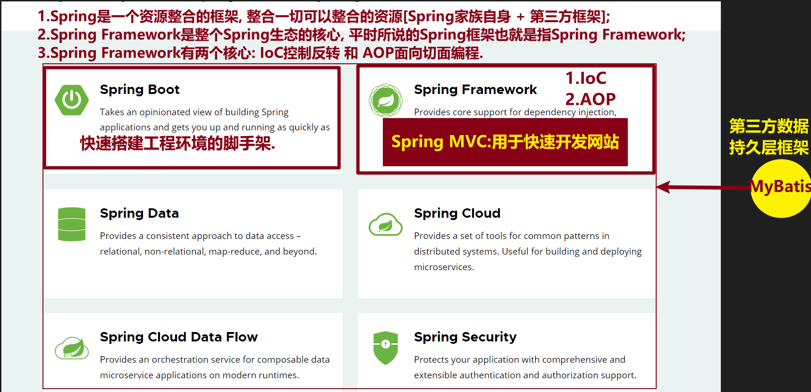
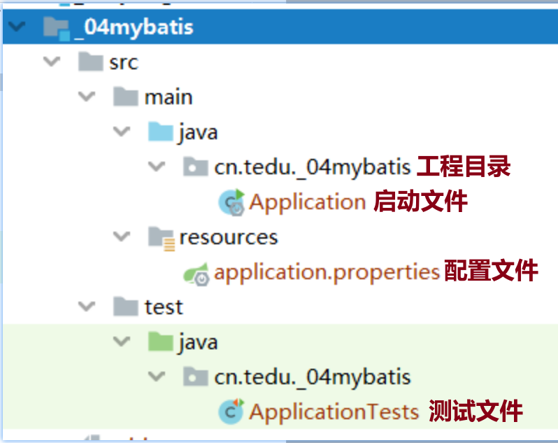
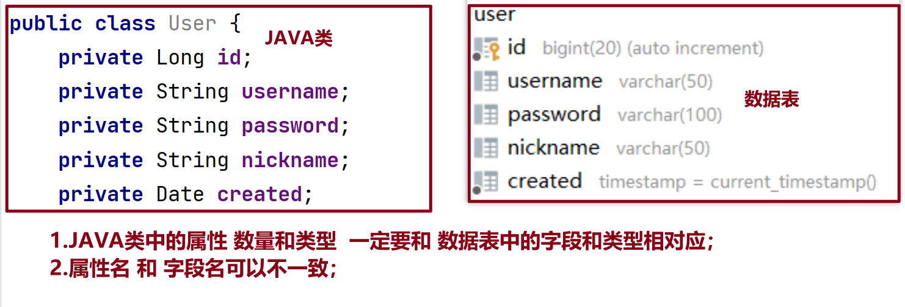
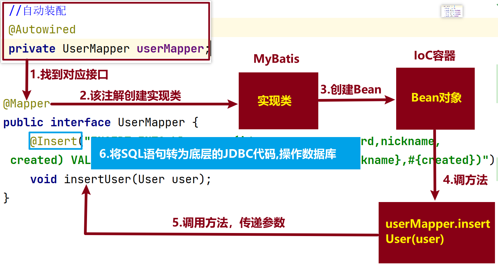
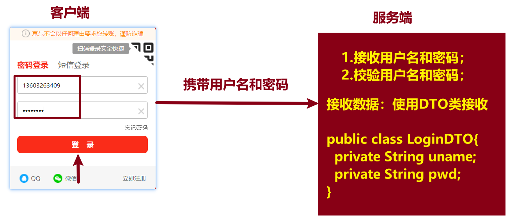
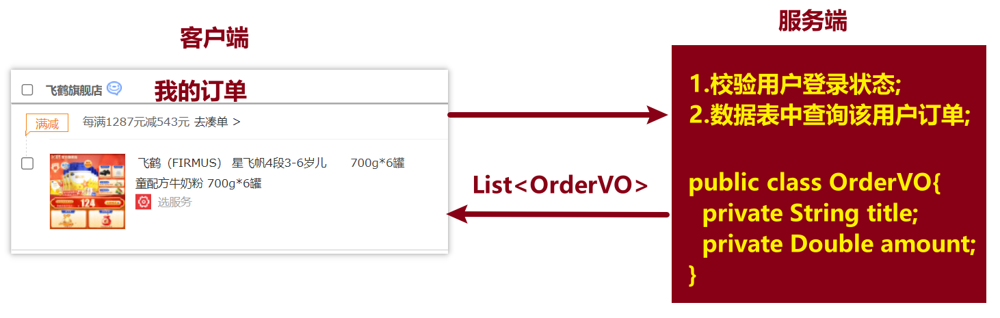

[toc]



### 1 介绍一下SSM

<font color=red>**SSM框架是指Spring + SpringMVC + MyBatis框架的组合**</font>

- Spring框架

  指 `Spring Framework`，是整个Spring生态的核心，提供了一个IoC容器，用于管理对象的生命周期和依赖关系。

- Spring MVC框架

  `SpringMVC` 是 `Spring Framework` 的子模块，基于Spring框架的MVC（Model-View-Controller，模型-视图-控制器）架构的Web框架，<font color=red>**用于快速开发Web应用程序**。</font>

- MyBatis框架

  `MyBatis` 是一个开源的 <font color=red>**数据持久层框架**</font>，它提供了一种将Java对象与关系型数据库之间进行映射的方式，MyBatis通过配置文件或注解来定义SQL映射。

### 2 关于SpringBoot

#### 2.1 什么是SpringBoot

<font color=red>**Spring Boot是一个Java软件开发框架（脚手架），用于快速搭建开发环境。**</font>

- 简化了 `Spring` 应用的初始搭建及开发过程，使开发人员不再需要大量的手动依赖管理；
- `SpringBoot` 整合了很多框架和第三方库的配置，达到 `开箱即用` ，对于`SpringBoot` 应用，这些第三方库几乎可以是零配置的开箱即用，或者只需要写少量的配置代码。

#### 2.2 SpringBoot核心特性

- **起步依赖**

  通过告诉Spring Boot需要什么功能，它就能自动引入需要的依赖库，非常方便；

- **自动配置**

  `Spring Boot` 能自动提供相关配置，针对很多Spring应用程序和常见的应用功能；

  比如：当 `Spring Boot` 检测到工程中存在某个注解或类时，它会自动将相关的 `bean` 注册到 `Spring` 容器中，而无需手动配置；

- **嵌入式服务**

  SpringBoot工程支持内嵌的web服务，可以将tomcat这样的服务直接嵌套到web依赖中。

#### 2.3 SpringBoot版本

- SpringBoot3：目前只支持 Java17 及以上版本；
- SpringBoot2：支持Java8版本，课程采用 **SpringBoot 2 版本**

#### 2.4 目录结构

SpringBoot工程的目录结构



### 3 ORM

ORM（**Object Relational Mapping**）叫做 <font color=red>**对象关系映射**</font>，用于将对象模型与关系型数据库之间进行映射；

目的是在程序开发中通过简化数据持久化的过程，提高开发效率；

ORM 将数据库中的表、字段、记录关系结构映射为类、属性、对象面向对象的结构。开发人员可以通过面向对象的方式操作数据库。

|    Java    |   数据库   |
| :--------: | :--------: |
|   一个类   |   一张表   |
| 一个类属性 | 一个表字段 |
|  一个对象  | 一条表记录 |

**注意:**



### 4 流程和原理

#### 4.1 注解方式代码流程

- 第1步：创建工程，勾选2个依赖，版本选择 `2.6.13`；
- 第2步：配置数据库连接信息 `application.properties`，注意 **库名**；
- 第3步：创建实体类 `pojo.entity.类名`；
- 第4步：创建接口，添加 `@Mapper` 注解；
- 第5步：定义接口方法[<font color=red>**判断是否需要提前创建 VO 类**</font>]；
- 第6步：定义测试方法，进行测试
  - **注意1**：测试类上添加 `@SpringBootTest` 注解；
  - **注意2**：测试方法上添加 `@Test` 注解；
  - **注意3**：测试方法  <font color=red>**无参无返回值**</font>；

#### 4.2 注解方式执行流程



### 5 POJO类

简单的Java对象，一般只定义一些基本的属性，没有业务逻辑没有任何方法。

* **实体类** `entity`

  实体类和数据表做一一映射关系。

* **DTO类**

  客户端传递给服务器端的数据，叫做DTO

  

* **VO类**

  服务端返回给客户端的数据

  

### 6 常见异常

- `SQLSyntaxErrorException`

  ```java
  Caused by: java.sql.SQLSyntaxErrorException: You have an error in your SQL syntax;
  ```

  **解决方案**：仔细检查SQL语句。

- `TooManyResultsException`

  ```java
  Caused by: org.apache.ibatis.exceptions.TooManyResultsException: Expected one result (or null) to be returned by selectOne(), but found: 2
  ```

  **解决方法**：使用 `List<>` 集合接收数据.


