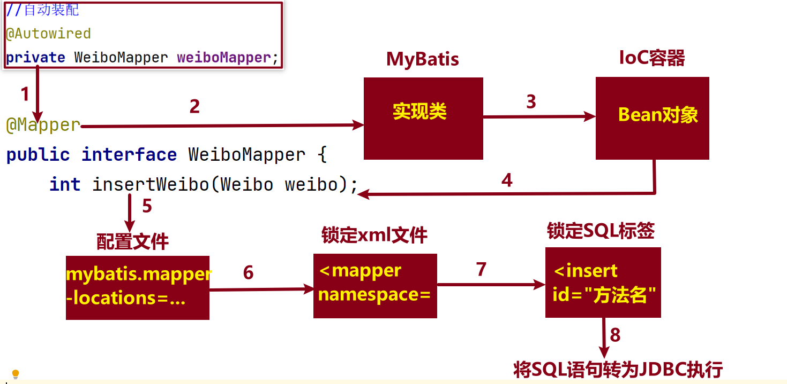

[toc]

### 1 XML配置MyBatis

#### 1.1 对比注解方式

MyBatis框架提供了注解方式和xml配置文件两种方式操作数据库；

* 注解方式：简单清晰，但是和 `java` 代码耦合到一起，不利于后期`SQL`语句的统一优化和维护，适用于 <font color=red>**比较简单的工程**</font>，不太适合复杂的工程；
* xml方式：<font color=red>**适用于复杂工程，比如：动态修改、动态删除等**</font>
  * 将 `SQL` 语句和 `JAVA` 代码分离开；
  * 支持动态 `SQL` 语句；
  * 支持 `SQL` 语句的重用.

#### 1.2 编码流程

- 第1步: 创建工程: `勾选 MySQL Driver,MyBatis Framework两个依赖, SpringBoot的版本为: 2.6.13`

- 第2步: 配置文件`application.properties`中配置数据库连接信息和xml文件映射位置

  ```properties
  spring.datasource.url=jdbc:mysql://localhost:3306/库名?查询参数
  spring.datasource.username=用户名
  spring.datasource.password=密码
  mybatis.mapper-locations=classpath:mappers/*.xml
  ```

- 第3步: 创建实体类 `工程目录.pojo.entity.实体类`, 和数据表做好映射关系

- 第4步: 创建接口 `工程目录.mapper.XxxMapper, 注意添加 @Mapper 注解`

- 第5步: 创建接口方法[<font color=red>**如有必要则先创建VO类**</font>]

- 第6步: `resources`目录下创建`mappers`目录,并拷贝 xml 的模板文件, 指定 `namespace` 属性值

  ```xml
  <mapper namespace="cn.tedu._04mybatis.mapper.UserMapper"></mapper>
  ```

- 第7步: 定义对应的标签, 完成SQL语句, 注意 `id属性值是接口方法名`

- 第8步: 测试

#### 1.3 执行流程图



### 2 XML标签

* 增删改查标签

  * 增删改

    <font color=red>**返回值为int类型**</font>

    ```xml
    1.<insert id=""></insert>
    2.<delete id=""></delete>
    3.<update id=""></update>
    ```

  * 查

    <font color=red>**返回值为 VO 类型**</font>
    
    ```xml
    1.<select id="" resultType=""></select>
    2.<select id="" resultMap=""></select>
    ```

* 动态标签

  * 动态删除

    ```xml
    <!--
    	1.collection属性：指定类型,数组为array,集合为list;
    	2.item属性：变量名;
    	3.separator属性：指定分隔符.
    -->
    <foreach collection="类型" item="变量名" separator="分隔符"></foreach>
    ```

  * 动态修改

    <font color=red>**注意 逗号 的问题**</font>

    ```xml
    <set>
    	<if test="条件">字段名=#{属性名},</if>
        <if test="条件">字段名=#{属性名}</if>
    </set>
    ```

* 重用标签

  ```xml
  <!-- 1. 定义重复标签 -->
  <sql id="唯一标识"></sql>
  
  <!-- 2. 引用重复标签 -->
  <include refid="sql标签的id属性值"></include>
  ```

### 3 常见异常

* **BindingException**

  ```java
  org.apache.ibatis.binding.BindingException: Invalid bound statement (not found): cn.tedu._04mybatis.mapper.CommentMapper.selectCommentById2
  ```

  <font color=red>**解决思路：**</font>

  * 第1步：查看配置文件 `application.properties`；
  * 第2步：查看 `xml` 文件中的命名空间 `namespace`；
  * 第3步：标签中的 `id` 属性值是否和 接口方法名一致.

* **BeanCreationException**

  <font color=red>**sqlSessionFactory：发现所有的测试方法都不能执行成功的情况.**</font>

  ```java
  Caused by: org.springframework.beans.factory.BeanCreationException: Error creating bean with name 'sqlSessionFactory' defined in class path resource: ...[C:\Users\TEACHER\IdeaProjects\jsd2311-ssm\_04mybatis\target\classes\mappers\CommentMapper.xml]
  ```

  <font color=red>**解决思路：**</font>

  * 第1步：到此行异常的末尾查看具体出问题的 `xml` 文件；
  * 第2步：检查对应的 `xml` 文件修改即可.

### 4 常用快捷键

- **复制文件完整路径**

  - windows系统

    - 没有Fn按键：**Ctrl + Shift + Alt + c**
    - 有Fn按键：**Fn + Ctrl + Shift + Alt + c**

  - Mac系统

    **Command + Shift + c**

- **格式化代码**

  `Ctrl + Alt + l`

-  **代码折叠和打开**

  - 折叠代码: Ctrl + Shift + 减号
  - 展开代码: Ctrl + Shift + 加号


