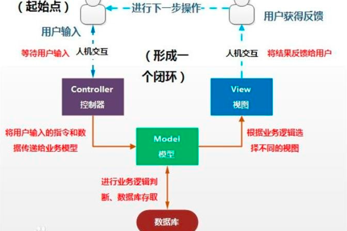
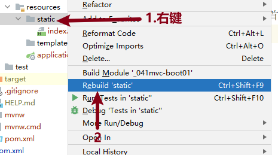
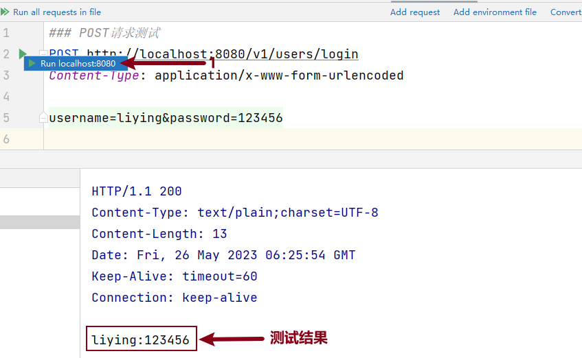

[TOC]

# SpringMVC

## 1 什么是MVC

### 1.1 MVC设计思想

MVC是一种软件架构的思想，将软件按照模型、视图、控制器来划分。

* M

  Model，模型层，负责业务逻辑判断，数据库存取

* V

  View，视图层，负责界面展示，向用户呈现数据的方式（html页面、图片、文本等）

* C

  Controller，控制器，负责接收用户请求，并根据请求调用相应的模型来处理业务逻辑




### 1.2 Spring MVC


SpringMVC是一种基于MVC（模型-视图-控制器）模式的Web框架，它是基于Spring框架的一个子项目。

它通过将请求分派给相应的控制器来处理Web请求，然后将处理结果发送回客户端。

处理流程如图：


1. 客户端发送请求至前端控制器DispatcherServlet；
2. DispatcherServlet收到请求后，调用处理器映射器HandlerMapping；
3. HandlerMapping根据请求URL找到具体的Controller；
4. 通过处理器适配器HandlerAdapter找到具体执行该方法的实现类；
5. Controller处理请求，并返回ModelAndView；
6. DispatcherServlet通过ViewReslover（视图解析器）确定负责显示数据的具体View；
7. DispatcherServlet对View进行渲染视图（即将Model填充至视图组件中），并将完整的视图响应到客户端。


## 2 SpringMVC快速入门

* 第1步：创建工程 **_051MVC-BOOT01**

  

* 第2步：选择 `2.7.17` 版本，并勾选 `Spring Web` 依赖项

  

  ```properties
  <dependency>
      <groupId>org.springframework.boot</groupId>
      <artifactId>spring-boot-starter-web</artifactId>
  </dependency>
  ```

* 第3步：启动工程

* 第4步：在resources/static目录下创建index.html

  ```html
  <h1>
      工程首页
  </h1>
  ```

* 第5步：<font color=red>**Rebuild static**</font>

  


## 3 SpringMVC处理请求

### 3.1 请求分类及处理方式

#### 3.1.1 静态请求

* 定义

  指请求的页面由服务器上预先准备好的静态web资源组成，如HTML、CSS、JS、IMG等，返回给客户端的信息内容是不变的。

* 处理方式

  由服务器直接将请求的资源返回给客户端，服务器不处理任何逻辑，只是将预先准备好的资源返回给客户端。
  
  

#### 3.1.2 动态请求

* 定义

  服务器会根据用户的请求动态生成内容，将数据返回到客户端显示页面内容。

* 处理方式

  由服务器从数据库中获取数据，并进行相应的逻辑处理后将处理结果返回客户端。
  
  


### 3.2 处理静态请求

#### 3.2.1 处理html文件请求

* 第1步：创建index.html（**已经创建**）浏览器输入地址测试

  http://localhost:8080/index.html

* 第2步：浏览器显示工程首页


#### 3.2.2 处理图片等请求

* 第1步：复制任意一张图片到static下

* 第2步：右键static目录，<font color=red>**Rebuild static**</font>

* 第3步：浏览器测试

  http://localhost:8080/liying.jpg

### 3.3 处理动态请求

通过在 `controller`  中定义对应的类及方法实现动态请求的业务逻辑处理。

#### 3.3.1 注解说明

* `@Controller` 

  添加在类上；

  表示该类是一个控制器，负责处理用户的请求，并将处理结果生成响应返回给客户端。

* `@RequestMapping` 

  请求注解；

  添加在控制器类或控制器方法上；

  将HTTP请求映射到控制器中的方法，指定处理请求的路径

  * 控制器类上：为整个控制器指定一个基础路径
  * 控制器方法上：指定相对于基础路径的具体路径

* `@ResponseBody` 

  响应注解；

  添加在控制器方法上；

  可以使控制器方法通过返回值的方式将响应返回给客户端。


#### 3.3.2 示例

<font color=red>**处理用户查询订单的请求**</font>

* 请求地址：http://localhost:8080/selectOrder
* 返回响应：String "查询订单成功~~"


<font color=red>**实现**</font>

* 第1步： 工程目录下新建 controller.OrderController

  ```java
  // @Controller:用于将一个类标识为SpringMVC中的控制器，负责处理用户的请求并将响应返回给客户端
  @Controller
  public class OrderController {
      // 1.请求注解
      @RequestMapping("/selectOrder")
      // 2.响应体注解，添加此注解后，可以通过返回值的方式响应给客户端数据
      @ResponseBody
      public String selectOrder(){
          return "查询订单成功~~";
      }
  }
  ```

* 第2步：**重启工程** 后浏览器测试

  http://localhost:8080/selectOrder


### 3.4 常见问题

* 工程已修改，但是浏览器刷新未出现效果
  * 工程static目录下文件修改后必须 <font color=red>**Rebuild static**</font>
  * 浏览器有之前页面的缓存，Shift + F5 刷新页面
* 404错误码代表找不到资源
  * 找不到静态资源
    * 检查请求的路径是否正确   
    * 检查静态资源文件的存储位置是否在static里面  
    * 选中static文件夹 ReBuild 重新编译再测试
  * 找不到动态资源

    - 检查请求的路径是否正确   
    - 检查@Controller注解是否添加
    - 检查@RequestMapping注解里面的处理路径是否正确 


## 4 HTTP

### 4.1 HTTP协议

<font color=red>**超文本传输协议**</font>

HTTP协议是浏览器与服务器通讯的应用层协议，规定了浏览器与服务器之间的交互规则以及交互数据的格式信息等。

- 用途 ： 网页获取，数据的传输
- 特点
  - 应用层协议，使用tcp进行数据传输；
  - 有丰富的请求类型；
  - 可以传输的数据类型众多.

### 4.2 访问网页流程

1. 客户端（浏览器）通过tcp传输，发送http请求给服务端；
2. 服务端接收到http请求后进行解析；
3. 服务端处理请求内容，组织响应内容；
4. 服务端将响应内容以http响应格式发送给浏览器；
5. 浏览器接收到响应内容，解析展示.

### 4.3 请求和响应

#### 4.3.1 HTTP请求 Request

<font color=red>**浏览器给服务端发送的内容称为请求Request，一个请求包含三部分:请求行，请求头，请求体**</font>

- 请求行 ： 具体的请求类别和请求内容

  ```java
  GET         /        HTTP/1.1
  请求类别   抽象路径     协议版本
  
  /**关于请求类别*/
  请求类别：每个请求类别表示向服务器端发请求做不同的操作
     GET : 获取服务器资源
     POST ：新增服务器资源
     PUT ： 更新服务器资源
     DELETE ： 删除服务器资源
      
  /**关于抽象路径*/
  请求URL地址为：http://localhost:8080/
  请求行为：    GET / HTTP/1.1
  
  请求URL地址为：http://localhost:8080/v1/users/login
  请求行为：    GET /v1/users/login HTTP/1.1
  
  请求URL地址为：http://localhost:8080/v1/users/reg
              GET /v1/users/reg HTTP/1.1
  ```

- 请求头：对请求的进一步解释和描述

  请求头是浏览器可以给服务端发送的一些附加信息，有的用来说明浏览器自身内容，有的用来告知服务端交互细节，有的告知服务端消息正文详情等。

  ```http
  Host: localhost:8080
  Connection: keep-alive
  User-Agent: Mozilla/5.0 (Windows NT 10.0; Win64; x64) AppleWebKit/537.36 (KHTML, like Gecko) Chrome/79.0.3945.130 Safari/537.36
  Accept: text/html,application/xhtml+xml,application/xml;q=0.9,image/webp,image/apng,*/*;q=0.8,application/signed-exchange;v=b3;q=0.9
  Accept-Encoding: gzip, deflate, br
  Accept-Language: zh-CN,zh;q=0.9
  ```

- 请求体: 请求参数或者提交内容

  请求体通常是用户上传的信息，比如:在页面输入的注册信息，上传的附件等内容。

  


#### 4.3.2 HTTP响应 Response

<font color=red>**服务端给浏览器发送的内容称为响应Response，一个响应包含三部分:响应行，响应头，响应体。**</font>

* 响应行

  ```java
  HTTP/1.1     200       OK
  版本信息    响应码   附加信息
  响应码 ： 
      1xx:保留
      2xx:成功，表示处理成功，并正常响应
      3xx:重定向，表示处理成功，但是需要浏览器进一步请求
      4xx:客户端错误，表示客户端请求错误导致服务端无法处理
      5xx:服务端错误，表示服务端处理请求过程出现了错误
  ```

* 响应头

  响应头与请求中的消息头格式一致，表示的是服务端发送给客户端的附加信息。

  ```java
  HTTP/1.1 200 OK
  Content-Type: text/html
  Content-Length: 3546
       
  //Content-Length是用来告知浏览器响应正文的长度，单位是字节。
  ```

  <font color=red>**`Content-Type` 是用来告知浏览器响应正文中的内容是什么类型的数据(图片，页面等等)不同的类型对应的值是不同，浏览器接收正文前会根据上述两个响应头来得知长度和类型从而读取出来做对应的处理以渲染给用户看。**</font>

  | 文件类型 |  Content-Type对应的值  |
  | :------: | :--------------------: |
  |   html   |       text/html        |
  |   css    |        text/css        |
  |    js    | application/javascript |
  |   png    |       image/png        |
  |   gif    |       image/gif        |
  |   jpg    |       image/jpeg       |

* 响应体

  响应的主体内容信息

  

### 4.4 URL

#### 4.4.1 定义

​	URL（Uniform Resource Locator）是互联网上 <font color=red>**统一资源定位符**</font> 的简称，用于标识和定位互联网上资源的地址。在Web浏览器中，URL是用于访问网页的地址。

#### 4.4.2 URL组成

<font color=red>**http://localhost:8080/v1/users/login?username=xxx&password=yyy**</font>

* 协议（Protocol）：指定访问资源的协议类型，常见的协议包括HTTP、HTTPS等。

* 主机名（Hostname）：指定要访问的服务器的主机名或域名。

* 端口号（Port）：指定服务器的端口号，不同的协议和应用程序使用不同的端口号。

* 路径（Path）：指定要访问的资源的路径，即文件或文件夹的路径。

* 查询参数（Query Parameters）：用于传递一些额外的信息给服务器，例如参数化的查询条件。

  <font color=red>**查询参数和路径Path之间使用 ？分隔，多个查询参数之间使用 & 分隔。**</font>


#### 4.4.3 注意事项

* URL地址是区分大小写的，因此在输入时要注意大小写的一致性。

* URL地址中不能包含非法字符，例如空格、特殊符号等。如果需要传递参数或附加信息，可以使用查询参数或POST请求等方式。

### 4.5 请求方法

#### 4.5.1 GET请求

​	GET请求是HTTP协议中最常见的请求方式之一，<font color=red>**它用于从服务器获取数据**</font>。

​	GET请求将查询参数附加在URL之后，通过“?”符号进行分隔。

* 查询参数

  GET请求的参数通常以键值对的形式附加在URL之后。例如，以下URL中，“?name=John&age=25”是两个查询参数，分别表示名字和年龄

  ```html
  http://example.com/users?name=John&age=25
  ```

* 注意事项

  - GET请求的参数是可见的，因此在URL中传递敏感信息时需谨慎。
  - GET请求的长度有限制，因为URL的长度有限制，因此当传递大量数据时，应考虑使用POST或其他方式。

* <font color=red>**发送GET请求**</font>

  在浏览器中输入URL地址确认即可向服务端发送GET请求。

  `http://localhost:8080/v1/users/login?username=xxx&password=xxx`

#### 4.5.2 POST请求

​	POST请求是另一种常见的HTTP请求方式，它用于向服务器提交数据。与GET请求不同，POST请求将数据放在请求体（Request Body）中，而不是URL中。

* 请求体

​	POST请求的请求体中包含要提交的数据。这些数据可以是JSON、XML或其他格式。请求体中的数据通过Content-Type头部指定。

* 请求示例

  ```http
  POST /users HTTP/1.1  
  Host: example.com  
  Content-Type: application/json  
  Request Body: {"username": "john", "password": "secret"}
  ```

* 使用POST请求的注意事项

  * POST请求的数据是私密的，不会显示在URL中，因此更适合传递敏感信息。

  * POST请求的长度没有限制，可以提交大量的数据。

* <font color=red>**发送POST请求**</font>

  经常在 `form` 表单中发送。

  ```html
  <form action="请求地址" method="post">
      <input type="text" name="username">
      <input type="text" name="password">
      <input type="submit" name="登录">
  </form>
  ```

### 4.6 传递数据方式

<font color=red>**客户端向服务端传递数据的方式分为GET请求和POST请求两种方式。**</font>

#### 4.6.1 GET请求

在查询参数中传递，比如：

```html
http://localhost:8080/v1/users/login?username=xxx&password=xxx
```

#### 4.6.2 POST请求

在请求体中传递，比如：

```html
<form action="请求地址" method="post">
    <input type="text" name="username">
    <input type="text" name="password">
    <input type="submit" name="登录">
</form>
```


## 5 服务端接收参数

### 5.1 HttpServletRequest接收

* HttpServletRequest是Java Servlet规范中定义的一个接口，它提供了与HTTP请求相关的方法和属性。

* 在Java Web应用程序中，当客户端发送HTTP请求时，容器（例如Tomcat）会创建一个HttpServletRequest对象，该对象包含了客户端请求的所有信息，如请求的URL、请求方法、请求头、请求参数等。

* 在请求处理过程中，开发人员可以使用HttpServletRequest对象来获取客户端发送过来的请求参数。通过调用HttpServletRequest的方法，可以获取请求的参数名称、参数值以及参数的数量等信息。


以上述案例为准，客户端把用户名和密码信息传递给服务端，服务端接收传递过来的用户名和密码信息。

* 第1步：controller.UserController 处理请求

  ```java
  /**方式1：使用HttpServletRequest接收数据*/
  @RequestMapping("/v1/users/login")
  @ResponseBody
  public String login(HttpServletRequest request){
      String username = request.getParameter("username");
      String password = request.getParameter("password");
  
      return username + ":" + password;
  }
  ```

* 第2步：重启工程测试


### 5.2 声明参数接收

可以在处理请求的方法中通过 **声明参数的方式** 来接收客户端传递过来的数据。

<font color=red>**应用分析**</font>

* 第1步：controller.UserController处理登录请求

  ```java
  /**方式2：通过声明参数的方式接收*/
  @RequestMapping("/v1/users/login")
  @ResponseBody
  // 好处：代码简洁，并且可以自动根据声明的类型进行转换
  public String login(String username, String password){
      return "username = " + username + ", password = " + password;
  }
  ```

* 第2步：重启工程，执行测试脚本测试


### 5.3 声明POJO类接收

如果客户端传递数据过多，通过 `HttpServletRequest` 方式接收复用性较差，通过 `声明参数接收` 又很繁琐；所以可以将数据封装到 `POJO类` 中来接收。

<font color=red>**操作步骤**</font>

* 第1步：controller.UserController处理登录请求

  ```java
  /**方式3：通过声明Pojo类接收*/
  @RequestMapping("/v1/users/login")
  @ResponseBody
  public String login(User user){
      return user.toString();
  }
  ```

* 第2步：自定义pojo类，工程目录下创建entity.User

  ```java
  public class User {
      // 客户端传递几个参数，此处就有几个属性
      private String username;
      private String password;
      
      // 省略 setter()  getter()  和 toString() 方法
  }
  ```

* 第3步：重启工程后测试


## 6 HttpClient测试

### 6.1 HttpClient说明

使用SpringMVC中提供的 `.http` 后缀的文件来测试 Controller 层接口。

<font color=red>使用三个 # 号 作为不同测试方法的分隔符，也可以作为注释说明。</font>

<font color=red>**应用分析**</font>

* 第1步：在test目录下创建 Directory ：http

* 第2步：创建 `.http` 后缀的文件进行测试：testUserController.http

  ```http
  ### GET请求测试
  GET http://localhost:8080/v1/users/login?username=liying&password=123456
  Accept: application/json
  
  ### POST请求测试
  POST http://localhost:8080/v1/users/login
  Content-Type: application/x-www-form-urlencoded
  
  username=liying&password=123456
  ```

* 第3步：执行对应的请求方法测试

  

### 6.2 练习

**使用当前工程实现：BMI身体质量指数测试  BMIController**

客户端将用户的 身高`height`和 体重`weight` 传递给服务端，服务端接收参数并计算用户的身体健康指数。

```java
计算公式：bmi = 体重kg/(身高m*身高)
<18.5 偏瘦
<24 正常
<27 微胖
>=27 该减肥了
```

#### 6.2.1 接口说明 BMIController

* 请求地址：/bmi
* 请求方法：GET
* 传递数据：height=用户身高   weight=体重

* 返回响应：String   偏瘦 | 正常 | 微胖 | 该减肥了


#### 6.2.2 步骤梳理

1. 创建 `controller.BMIController`

   在其中定义bmi方法处理 `/bmi `请求，在参数列表中通过 **声明变量的方式** 接收传递过来的身高和体重


  2. 在bmi方法中通过bmi的计算公式得到结果，然后根据取值范围给客户端响应

     偏瘦/正常/微胖/该减肥了

  3. 测试成功后，请用 <font color=red>**POJO类方式**</font> 接收数据再次实现


## 7 POJO

### 7.1 定义

Plain Ordinary Java Object：简单的Java对象；

是没有继承任何类或实现任何接口的简单 Java 对象，也不依赖于其他复杂的框架或技术；

POJO 对象通常包含了纯粹的数据和简单的业务逻辑，是一种用于简化 Java 应用程序开发的编程模型；

是entity实体类、VO（Value Object或View Object）视图对象、DTO（Data Transfer Object）数据传输对象 这3个对象的总称。


### 7.2 entity实体类|DTO|VO

* entity实体类作用

  用来和数据库中的表字段一一对应的，比如UserEntity(id,username,password,nickname)；

* DTO作用

  用来接收客户端传递给服务器的数据的，比如：UserLoginDTO(username,password)    实现登录功能，客户端向服务器端传递数据；

* VO作用

  用来处理服务器响应给客户端的数据的，比如：UserListVO(id,username,nickname)  登录成功后的列表页显示当前用户信息。


## 8 用户管理系统

### 8.1 数据初始化

* 库名：mvcdb

* 表名：user

  用户id、用户名username、密码password、昵称nickname、创建时间created

* 建库建表语句

  ```mysql
  CREATE DATABASE IF NOT EXISTS mvcdb DEFAULT CHARSET = UTF8;
  USE mvcdb;
  DROP TABLE IF EXISTS user;
  CREATE TABLE user
  (
      id       INT PRIMARY KEY AUTO_INCREMENT,
      username VARCHAR(50),
      password VARCHAR(50),
      nickname VARCHAR(50),
      created  TIMESTAMP
  );
  ```

### 8.2 工程准备

* 第1步：创建工程：**_052MVC-BOOT02**

  * SprintBoot版本为2.7.17
  * 勾选依赖
    * Spring Web
    * MyBatis Framework
    * MySQL Driver

* 第2步：application.properties配置文件中定义连接数据库信息

  可复制之前工程中的，但是库名要改为：**mvcdb**

  ```properties
  spring.datasource.url=jdbc:mysql://localhost:3306/mvcdb?serverTimezone=Asia/Shanghai&characterEncoding=utf8
  spring.datasource.username=root
  spring.datasource.password=root
  ```

* 第3步：application.properties配置文件中定义xml文件配置路径

  ```properties
  # 设置MyBatis框架的映射（Mapper）配置文件的位置
  mybatis.mapper-locations=classpath:mappers/*.xml
  ```

* 第4步：static目录下创建工程首页：index.html

* 第5步：启动工程，浏览器访问测试  http://localhost:8080/index.html


### 8.3 添加用户

#### 8.3.1 接口说明

用户将：用户名、密码、昵称 数据传递给服务端，服务端处理请求并将数据存入数据表。

* 请求地址：/v1/users/insert
* 请求方法：POST
* 请求体数据：用户名username、密码password、昵称nickname
* 返回响应：添加成功

#### 8.3.2 操作步骤

* 创建实体类：`pojo.entity.User`

* 创建DTO类：`pojo.dto.UserDTO`

* 创建控制器并定义方法：

  * 控制器：`controler.UserController`   
  * 控制器方法： `addUser()` 

* 创建映射接口及接口方法：

  * 映射接口：`mapper.UserMapper` 
  * 接口方法： `insert()` 

* xml配置SQL

* UserController中自动装配，完成添加用户功能并返回响应

* 重启工程，完成测试(`.http` 后缀文件)


### 8.4 用户列表

#### 8.4.1 接口说明

* 请求地址：`/v1/users/userList`
* 请求方法：GET
* 查询参数：无
* 返回响应：`List<UserListVO>`   显示: 用户名username 和 密码password

#### 8.4.2 操作步骤

* 定义映射接口方法：`mapper.UserMapper` 
* xml 配置 SQL

* 处理请求并返回响应：`UserController` 

* 测试


### 8.5 删除用户

#### 8.5.1 接口说明

* 请求地址：/v1/users/delete?id=用户id
* 请求方法：GET
* 查询参数：用户id
* 返回响应：String "删除成功"

#### 8.5.2 操作步骤

* 定义映射接口方法：`mapper.UserMapper` 
* xml 配置 SQL

* 处理请求并返回响应：`UserController` 

* 测试


### 8.6 更新用户

#### 8.6.1 接口说明

* 请求地址：/v1/users/update
* 请求方法：POST
* 请求体数据：用户id、用户名username、密码password、昵称nickname、时间created
* 返回响应：String "修改成功"

#### 8.6.2 操作步骤

* 定义接口方法：UserMapper
* xml 配置 SQL
* UserController 处理请求并返回响应


### 8.7 工程优化

#### 8.7.1 @RestController注解优化

* 问题

  controller中能否不要每个方法都写 @Responsebody 注解？

* 解决

  在类上将原来的 `@Controller` 注解替换为：`@RestController`

* 说明

  `@RestController`注解作用于类上；
  
  作用是将类中的方法返回值直接作为HTTP响应的内容；
  
  在控制器类中加入该注解后，无需在每个方法上添加`@ResponseBody`注解；
  
  可以让Spring框架自动将方法的返回值序列化并填充到HTTP响应中，实现Web服务端点的快速开发。

#### 8.7.2 @RequestMapping注解优化

* 问题

  @RequestMapping注解中每个都有 /v1/users/xxx，能否简化一下？

* 解决

  在类上添加@RequestMapping注解，填写相同部分的地址，比如

  ```java
  1.类中注解：@RequestMapping("/v1/users/")
  2.方法注解：@RequestMapping("login")
  ```

#### 8.7.3 @Mapper注解优化

* 问题

  能否不用在每个XxxMapper映射接口上都添加 `@Mapper` 注解？

* 解决

  创建配置类，设置自动扫描 `@Mapper` 注解

  在工程中新建config.MyBatisConfig类，添加 `@MapperScan` 注解设置自动扫描。

* `@MapperScan` 注解说明

  添加在 **Spring配置类** 上；

  **用于告诉 Spring 扫描 MyBatis Mapper 接口并创建对应的 Mapper 实现；**

  可以指定扫描 MyBatis 映射器接口的包名。

  ```java
  // 1.Configuration注解：设置当前类为配置类，启动工程时会自动运行
  @Configuration
  // 2.MapperScan为扫描注解，省去了每个Mapper映射接口上面添加@Mapper注解
  //   参数为mapper的包的完整路径
  @MapperScan("cn.tedu._052mvcboot02.mapper")
  public class MybatisConfig {
  }
  ```


## 9 练习实操

### 9.1 员工管理系统练习

<font color=red>**创建独立的子工程，实现数据表的增删改查**</font>

员工管理系统，实现公司对员工的增删改查操作。

员工表 **emp** 字段包含：员工编号id，员工姓名title，员工工资salary，员工岗位job


#### 9.1.1 项目准备

* 创建 **egmvc1** 工程

  * SpringBoot版本为 2.7.17
  * 勾选3项依赖：Spring Web、MyBatis Framework、MySQL Driver

* 配置文件中配置数据库连接信息和xml映射文件位置

* 建库建表

  ```mysql
  CREATE DATABASE IF NOT EXISTS mvcdb DEFAULT CHARSET=UTF8;
  USE mvcdb;
  CREATE TABLE emp(
  	id		INT PRIMARY KEY AUTO_INCREMENT,
  	title	VARCHAR(20),
  	salary	DOUBLE(10,2),
  	job		VARCHAR(20)
  )CHARSET=UTF8;
  ```
  
* 启动工程


#### 9.1.2 项目接口

##### 1）添加员工

* 请求地址：`/emp/insert`
* 请求方法：`POST`
* 请求体数据：`员工姓名title、员工工资salary、员工岗位job`
* 返回响应：`String  "添加成功"`


##### 2）查询所有员工的  姓名和岗位

* 请求地址：`/emp/select`
* 请求方法：`GET`
* 查询参数：`无`
* 返回响应：`List<EmpVO>`


##### 3）修改员工信息

* 请求地址：`/emp/update?id=员工编号&title=员工姓名&salary=员工工资&job=员工岗位`
* 请求方法：`GET`
* 查询参数：`id=员工编号&title=员工姓名&salary=员工工资&job=员工岗位`
* 返回响应：`String  "修改成功"`


##### 4）删除员工信息

* 请求地址：`/emp/delete?id=员工编号`
* 请求方法：`GET`
* 查询参数：`id=员工编号`
* 返回响应：`字符串 "删除成功"`


### 9.2 地址管理系统练习

#### 9.2.1 项目准备

本工程为收货地址管理，用户可以添加收货地址，查询收货地址，删除收货地址，修改收货地址，请实现收货地址的增删改查操作。

##### 1）数据表：收货地址表

1. 收货地址id  INT PRIMARY KEY AUTO_INCREMENT,

2. 收件人receiver  VARCHAR(20),

3. 收货地址address VARCHAR(255),

4. 收件人邮箱email VARCHAR(255),

5. 收件人手机号mobile CHAR(11),

6. 地址标签（**家、公司、宿舍等**）tag VARCHAR(10)

   ```mysql
   CREATE DATABASE IF NOT EXISTS mvcdb DEFAULT CHARSET=UTF8;
   USE mvcdb;
   DROP TABLE IF EXISTS address;
   CREATE TABLE address
   (
       id       INT PRIMARY KEY AUTO_INCREMENT,
       receiver VARCHAR(20),
       address  VARCHAR(255),
       email    VARCHAR(255),
       mobile   CHAR(11),
       tag      VARCHAR(10)
   )CHARSET=UTF8;
   ```

##### 2）工程

* 创建 **egmvc2** 工程，勾选3项依赖，SpringBoot版本为2.7.17
* 配置文件中配置数据库信息及xml映射文件位置
* 启动工程

#### 9.2.2 项目接口

##### 1）添加收货地址

* 请求地址：`/address/insert`
* 请求方法：`POST`
* 请求体数据：`receiver=收件人、address=收件地址、email=邮箱、mobile=手机号、tag=标签`
* 返回响应：`String "添加成功"`

##### 2）查询收货地址

* 请求地址：`/address/select`

* 请求方法：`GET`

* 查询参数：`无`

* 返回响应：`List<Address>`  <font color=red>**查询所有字段，放到实体类即可，无须创建VO类了**</font>


##### 3）删除收货地址

* 请求地址：`/address/delete`

* 请求方法：`POST`

* 请求体数据：`id=地址id`

* 返回响应：`String "删除成功"`


##### 4）修改收货地址

* 请求地址：`/address/update`
* 请求方法：`POST`
* 亲球体数据：`id=xx&receiver=xx&address=xx&email=xxx&mobile=xx&tag=xx`
* 返回响应：`String "修改成功"`


## 10 注解总结

* `@Controller` 注解

  标注一个类；

  表示该类是一个控制器，负责处理用户的请求，并将处理结果生成响应返回给客户端。

* `@RequestMapping` 注解

  请求注解；

  添加在控制器类或控制器方法上；

  将HTTP请求映射到控制器中的方法，指定处理请求的路径

  * 控制器类上：为整个控制器指定一个基础路径
  * 控制器方法上：指定相对于基础路径的具体路径

* `@ResponseBody` 注解

  响应注解；

  添加在控制器方法上；

  可以使控制器方法通过返回值的方式将响应返回给客户端。

* `@RestController` 注解

  作用于类上；

  作用是将类中的方法返回值直接作为HTTP响应的内容；

  在控制器类中加入该注解后，无需在每个方法上添加`@ResponseBody`注解；

  可以让Spring框架自动将方法的返回值序列化并填充到HTTP响应中，实现Web服务端点的快速开发。

* `@MapperScan` 注解说明

  添加在 **Spring配置类** 上；

  **用于告诉 Spring 扫描 MyBatis Mapper 接口并创建对应的 Mapper 实现；**

  可以指定扫描 MyBatis 映射器接口的包名。
