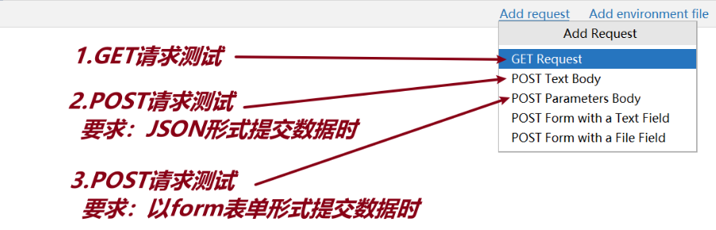

[toc]

### 1 MVC和Spring MVC

#### 1.1 MVC

<font color=red>**MVC是一种软件架构的设计思想，目的是降低项目中各个模块间的耦合度。**</font>

模型视图控制器，`Model View Controller`

- 模型层Model：负责业务逻辑处理和数据库的操作；
- 视图层View：负责页面最终的展示；
- 控制器层Controller：负责接收请求，并调用模型层处理业务逻辑，以及组织响应结果的返回。

#### 1.2 Spring MVC

不同的编程语言，针对于MVC的设计思想，提供了不同的框架；

Spring MVC 是 Java 编程语言中提供的基于 MVC 设计思想 的框架，用于快速开发Web应用程序，是Spring Framework中的核心子框架。

其他编程语言中也有对应的基于MVC设计思想的框架，比如：Python语言中的 Django、Flask框架等。

### 2 请求分类

#### 2.1 静态请求

- 说明

  固定的统一的文件，比如：`html文件、图片文件等`，所有用户得到的响应是相同的。

- 问题

  如果修改了 `html` 页面的代码，但是浏览器刷新页面未得到此页面，解决方案如下：

    - 是否 `Rebuild static` ;
    - 浏览器缓存问题，清除浏览器缓存，或者强制刷新浏览器 `Shift + F5`.

- `Spring MVC` 处理静态请求

    - 第1步：将前端文件放在 `resources/static/` 目录下；
    - 第2步：`Rebuild static`；
    - 第3步：浏览器访问测试即可.

#### 2.2 动态请求

- 定义

  每个用户向同一个URL地址发请求，得到的结果都不一样。

- SpringMVC处理动态请求

    * 第1步：控制器类上添加 `@Controller` 注解；
    * 第2步：控制器方法上添加 `@RequestMapping("路径")`；
    * 第3步：控制器方法上添加 `@ResponseBody` 注解.

### 3 关于HTTP

#### 3.1 HTTP和HTTPS

<font color=red>**超文本传输协议**</font>

##### 3.1.1 HTTP

* 端口号：80；
* 数据传输：数据以明文的方式传输，不安全；
* 传输效率：效率高；
* 不需要做证书；

##### 3.1.2 HTTPS

* 端口号：443；
* 数据传输：数据以加密的方式传输，安全；
* 传输效率：相对较低；
* 需要做SSL证书认证.

#### 3.2 请求和响应

##### 3.2.1 请求HttpRequest

* 请求行：请求方法、请求路径、HTTP协议版本
    * 新增资源：POST
    * 查询资源：GET
    * 更新资源：PUT
    * 删除资源：DELETE
* 请求头：对请求的进一步解析和描述
* 请求体：客户端传递给服务端的具体数据

##### 3.2.2 响应HttpResponse

* 响应行：HTTP协议版本、状态码、附加信息
    * 2XX：成功
    * 3XX：重定向
    * 4XX：客户端错误
    * 5XX：服务端错误
* 响应头：服务端发送给客户端的附加信息
* 响应体：服务端返回给客户端的具体数据

### 4 数据传递与接收

#### 4.1 客户端传递数据到服务端

##### 4.1.1 GET请求

- 发送请求方式: 浏览器地址栏输入地址, 敲击回车即可.

- 传递数据: 通过 <font color=red>**查询参数**</font> 的方式传递

  *
  *[http://localhost:8080/v1/users/login?username=xxx&password=xxx](https://gitee.com/link?target=http%3A%2F%2Flocalhost%3A8080%2Fv1%2Fusers%2Flogin%3Fusername%3Dxxx%26password%3Dxxx)
  **

##### 4.1.2 POST请求

- 发送请求方式: 在 `<form>` 表单中发送

- 传递数据: 通过 `<input>` <font color=red>**表单控件**</font> 的方式传递

  ```html
  <form action="http://localhost:8080/v1/carts/aaa" method="post">
      <input type="text" name="title">
      <input type="text" name="price">
      <input type="submit" value="添加购物车">
  </form>
  ```

#### 4.2 服务端接收数据

##### 4.2.1 HttpServletRequest接收

```java
public String login(HttpServletRequest request){
    String username = request.getParameter("username");
    String password = request.getParameter("password");

    return username + ":" + password;
```

##### 4.2.2 声明参数接收

```java
public String login(String username, String password){
    return username + ":" + password;
}
```

##### 4.2.3 声明POJO类[DTO类]

- 定义DTO类：`UserLoginDTO`

  ```java
  public class UserLoginDTO {
      //用户名,密码
      private String username;
      private String password;
  }
  ```

- 控制器中接收数据：`UserController`

  ```java
  @RequestMapping("/v1/users/login")
  @ResponseBody
  public String login(UserLoginDTO userLoginDTO){
      String username = userLoginDTO.getUsername();
      String password = userLoginDTO.getPassword();
  
      return username + ":" + password;
  ```

<font color=red>**原则：参数数量1-2个时, 使用声明参数的方式接收; 高于2个时, 使用POJO类接收.**</font>

### 5 企业级项目

#### 5.1 项目整体设计

* 用户模块 (<font color=red>**UserController**</font>)
    * 功能：登录、注册、修改密码、忘记密码、第三方登录... ...
* 商品模块(<font color=red>**GoodsController**</font>)
    * 功能：首页展示、商品列表页、商品详情页...
* 购物车模块(<font color=red>**CartsController**</font>)
* 订单模块(<font color=red>**OrdersController**</font>)
* 支付模块(<font color=red>**PaysController**</font>)

#### 5.2 项目开发流程

* 需求文档 - 产品经理

* 原型图设计 - UI设计师

* 数据库设计 - 数据架构师

* 前后端并行开发

    * 前端工程师：根据原型图完成页面编写

    * 开发工程师：完成服务端的具体功能

      <font color=red>**开发工程师在开发功能时，是没有前端页面的，所以开发需要通过测试工具进行测试.**</font>

* 前后端联调

* 项目测试 - 测试工程师

* 部署上线

* 运行维护 更新迭代

#### 5.3 测试相关

##### 5.3.1 测试分类

* 测试阶段划分
    * 单元测试：最小模块的测试；
    * 集成测试：流程化测试；
    * 系统测试：工程软件和所依赖的周边硬件结合在一起；
    * 验收测试：甲方负责.
* 是否查看源代码
    * 黑盒测试：功能测试，不查看源代码，手动点点点；
    * 白盒测试：只查看源代码逻辑；
    * 灰盒测试：既查看源代码，也手动点点点；
* 是否自动化
    * 手工测试：手动点点点；
    * 自动化测试：编写自动化测试的脚本[**Python、Java**]
* 其他分类
    * 冒烟测试：正式测试开始之前的预测试；
    * 回归测试：缺陷修复后，重新测试.

##### 5.3.2 测试方法

* 等价类：有效等价类和无效等价类；
* 边界值：测试边界的点，精简5点[**2个上点、1个内点、2个外点**]
* 判定表
* 正交表
* 场景法

### 6 HttpClient测试

- 文件位置: **test/http/xxx.http**

- 多个测试方法分隔符[注释]: `### 空格`

- 添加测试方法

  

### 7 注意

* 调整静态资源后，一定要 <font color=red>**Rebuild static**</font>；
* 调整了 `Java` 代码后，一定要 <font color=red>**重启工程**</font> ；
* <font color=red>**404状态码解决方案**</font>
    * 第1步：确定是否重启工程；
    * 第2步：检查地址是否一致；
    * 第3步：检查是否添加了 `@Responsebody` 注解；
    * 第4步：清除浏览器缓存.

### 8 mvcboot02环境搭建

* 搭建 MyBatis 环境；
    * 第1步：配置文件[数据库连接信息和xml文件映射位置];
    * 第2步：创建接口文件 **mapper.UserMapper**；
    * 第3步：resources目录下创建：**mappers/UserMapper.xml**；
    * 第4步：绑定命名空间 **namespace** ；
    * 第5步：创建实体类 **pojo.entity.User**
    * 第6步：启动工程
* 搭建 Spring MVC 环境；
* 启动工程；
* 根据接口实现功能；


